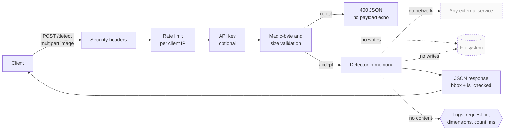

# Writeup: approach, trade-offs, limitations

## The problem, restated

Find every checkbox on a scanned document image and say whether it is marked.
The documents are US residential appraisal forms: dense ruled tables, printed
body text at several sizes, scan skew, JPEG artifacts, and in one case a
diagonal watermark across the page. A single page carries somewhere between
forty and a hundred and thirty checkboxes.

## Approach: classical computer vision

The pipeline is deterministic OpenCV:

1. **Grayscale and deskew.** Line extraction assumes rules are axis-aligned, so
   a two degree scan skew quietly destroys recall. The rotation estimate is
   discarded if it exceeds five degrees, on the grounds that a larger estimate
   is more likely to be wrong than the page is to be that crooked.
2. **Adaptive binarization.** Ink becomes white, paper black.
3. **Morphological line extraction.** Opening with a long thin horizontal
   kernel keeps horizontal rules and deletes text; the same in the vertical
   direction. A checkbox border is structurally a short horizontal run meeting
   a short vertical one, so combining the two masks leaves the borders standing
   on a page that is otherwise mostly glyphs.
4. **Contour filtering.** Candidates are kept on size, aspect ratio, extent and
   vertex count. Sizes are expressed as fractions of page width rather than in
   pixels, so the same thresholds hold at 200 or 600 DPI.
5. **Overlap suppression.** Thick borders and the two line passes can each
   produce a contour for the same box; the largest of an overlapping cluster
   wins.
6. **Classification.** The border is inset by 22% and the ink fraction of the
   remaining interior is measured. Above `CHECKED_INK_THRESHOLD` the box counts
   as marked.

## Alternatives considered

The brief permits any method and any tool, so the choice of a hand-built
pipeline is a decision that needs defending rather than a default. What follows
is what I weighed and why each was set aside.

### Fine-tuned object detection

A YOLO-family detector trained on annotated checkboxes is the obvious modern
answer, and there are public checkbox datasets to start from. Four images is not
a training set and, more to the point, not a validation set: a model tuned on
these pages would have memorised these pages, and I would have no honest way to
say whether it generalised. It is the right answer at a few hundred labelled
pages, which is why a labelled corpus is the first item under production work.

### Document understanding models

LayoutLM, Donut, DiT and the Table Transformer read documents, but none has a
checkbox primitive. LayoutLM classifies tokens with layout context and would
need a head trained for this; Donut is OCR-free sequence generation and does not
emit reliable pixel geometry; the Table Transformer recovers table structure,
which finds cells but says nothing about whether one is marked. PP-Structure and
docTR are strong at text and layout and equally silent on selection state. All
of them are heavier than the problem and none answers it directly.

### Vision-language models

A VLM will tell you a checkbox is ticked, and HomeVision uses LLMs in MIRA
already. Two things rule it out for this endpoint. Coordinate precision from
VLMs is weak: they describe reliably and localise approximately, and the
contract here is pixel geometry. And the output is nondeterministic per call,
against a decision an underwriter may later have to justify. Where it would earn
its place is narrower and more interesting: as a second opinion on the handful
of detections this pipeline already flags as low confidence, which is a small
enough slice to be affordable and exactly where the machine is least sure.

### Reading the PDF instead of the picture of it

When an appraisal arrives born-digital rather than scanned, its checkboxes are
vector rectangles in the content stream, and libraries like pdfplumber can read
them exactly, with no computer vision and no error. This corpus is scans, so it
does not apply here, but a production system should branch on it: pixels are the
fallback path, not the first one.

### Not extracting from the page at all

The strongest alternative is the one the sample documents point at themselves.

Their footers say what they are. `market_conditions_addendum` carries
"Freddie Mac Form 71 March 2009, UAD Version 9/2011 Produced by ClickFORMS
Software, Fannie Mae Form 1004MC March 2009, Page 21 of 31".
`manufactured_home_appraisal` carries "Freddie Mac Form 70B March 2005" and
"Form 1004C, TOTAL appraisal software by a la mode, inc.".

Three things follow. These are standardised GSE forms, not arbitrary paper. They
were generated by appraisal software from structured input rather than typed on
a typewriter. And they are stamped UAD, the Uniform Appraisal Dataset, which is
a data standard: UAD-compliant appraisals are delivered as MISMO XML, and the
checkbox values on these pages existed as fields before they existed as ink.
"Page 21 of 31" says this one is an excerpt from a real loan file.

So the question I would ask before building any of this in earnest is whether
the XML is available for a given document, because when it is, detecting
checkboxes from pixels is avoidable work carrying avoidable error. That is a
question about your ingestion pipeline rather than about computer vision, and I
do not know the answer. What I would expect is a system that prefers structured
data when it exists, reads vector geometry when the PDF is born-digital, and
falls back to detection for the scans, faxes and photographs that make up the
rest, which is a large and unavoidable share.

This service is that fallback, built well.

### Managed document AI services

This problem is already solved by products. Amazon Textract's `AnalyzeDocument`
with the `FORMS` feature returns `SELECTION_ELEMENT` blocks carrying a bounding
box and a `SelectionStatus` of `SELECTED` or `NOT_SELECTED`, which is this
challenge restated. Azure Document Intelligence calls the same thing selection
marks, Google Document AI exposes it through the form parser. The brief permits
any tool and HomeVision already runs on AWS, so the honest question is not
whether I knew, but why the default is a local pipeline.

Three reasons, none of them about accuracy:

- **The submission has to run.** A solution whose only path needs an AWS account,
  credentials and a billing relationship cannot be built and run from the
  instructions by whoever reviews it. That alone rules it out as the default.
- **Latency and cost per page.** A network round trip is one to three seconds
  against tens of milliseconds locally, and it carries a per-page charge. For a
  thousand-page loan file that difference is the architecture.
- **Every page leaves the process.** These documents carry borrower names,
  addresses and financial detail. Sending them out is a decision with compliance
  weight, not a default, even to a provider already in the stack.

So Textract is wired in as a swappable backend rather than ignored:
`POST /detect?engine=textract` runs the same contract through it, and selecting
it without credentials returns a clear error rather than a stack trace. The
parsing is tested against recorded Textract responses, so the adapter is covered
without credentials or a billed request.

The case for switching the default is real and I would make it on evidence: at
volume, against a labelled corpus, if Textract beats this pipeline by enough to
justify the cost and the data egress. That is a measurement I do not have, and
the harness in `eval/` is exactly where it would be run.

### Why the local pipeline won

The challenge ships four images. That is enough to sanity-check a heuristic and
nowhere near enough to train a detector, and, more importantly, nowhere near
enough to validate one honestly. Fine-tuning something like YOLO on four pages
produces a model that has memorised four pages.

The classical pipeline also buys three properties that matter in this domain:
it runs in tens of milliseconds on CPU with no GPU and no model artifact; every
decision reduces to a measurable quantity, which is the difference between "the
model said so" and "the interior was 31% ink against a 14% threshold"; and it
has no training data to govern, which in a regulated setting is one fewer thing
to audit.

If HomeVision already has labelled appraisal pages at volume, that calculus
changes and a learned detector is the better answer. This is a decision made
under the constraints of the exercise, not a claim that heuristics beat models.

### The most instructive bug

The first working revision reported over a thousand boxes per page. It was
matching the closed bowls of the letters `o`, `e`, `a` and `d`.

The cause was an inverted filter. I had reasoned that a hollow square traced by
its border would enclose little area and score a low extent, so I rejected high
extent shapes. In fact `cv2.contourArea` on an external contour returns the area
of the polygon it encloses, so a square border scores near 1.0 and was being
rejected, while ragged letter loops scored lower and sailed through. Every real
checkbox was being discarded and every letter kept.

Flipping it to a *minimum* extent turned the single loosest filter into the
strongest one. Detections on the densest page went from 1563 to 129, and text
false positives went to zero. `tests/test_detection.py::test_ignores_body_text`
is the regression test for it.

## Measurement, and what is not yet measured

`eval/evaluate.py` scores precision, recall and F1 at a configurable IoU
threshold, plus classification accuracy over matched boxes, per document and
pooled.

Annotation drafts are seeded from the detector's own output because typing a
hundred bounding boxes per page by hand is a poor use of time. That makes them
worthless as ground truth until corrected, so every file is written with
`"reviewed": false` and **the harness never scores a file until a human flips
that flag**. Scoring a detector against its own predictions returns a perfect
result and tells you nothing; the guard exists so that number can never
accidentally be reported. Unreviewed documents are skipped and named in the
output, so a partial corpus still yields an honest figure over the part that was
actually checked.

### Results

Three of the four documents have been reviewed to completion. Correcting each
meant inspecting every detection as an enlarged crop (`eval/contact_sheet.py`
renders them as a labelled grid), removing what was not a checkbox, fixing wrong
classifications, and hunting for boxes that were missed.

At IoU >= 0.5, over 240 hand-checked checkboxes:

| document | precision | recall | F1 | classification |
|---|---|---|---|---|
| uniform_residential_appraisal | 0.992 | 1.000 | 0.996 | 1.000 |
| manufactured_home_appraisal | 0.987 | 0.987 | 0.987 | 1.000 |
| neighborhood_site_section | 0.955 | 0.977 | 0.966 | 0.976 |
| **pooled** | **0.983** | **0.992** | **0.988** | **0.996** |

The fourth document is excluded for the reason set out below, and the harness
names it in its output rather than quietly averaging over what it has.

### Finding the misses without scanning by eye

Recall is the hard thing to measure honestly, because a missed checkbox leaves
nothing on screen to notice. Reading a four-thousand-pixel page looking for
absences is slow and unreliable.

Instead: run the detector a second time with deliberately loose thresholds, then
subtract everything the strict run already found. Whatever is left is the set of
shapes the strict pass rejected, and that is a short list worth looking at. On
`uniform_residential_appraisal` the loose pass produced 209 candidates against
125, leaving 84 to inspect, and every one turned out to be a text fragment or a
table-cell corner. That is what a recall of 1.000 on that page rests on, rather
than a claim that I looked carefully.

The same technique found nothing on the other pages either, which is why the one
false negative on record, on `neighborhood_site_section`, was caught the slow way
before this existed.

### What measuring bought, twice

The first score put precision at 0.875 against a recall of 0.977, which located
the problem precisely: the detector was not missing checkboxes, it was inventing
them. Four of the six false positives were letters of the vertical
`NEIGHBORHOOD` label, set in white type on a solid black sidebar. The counters of
`O`, `D` and `B` are small light squares fully enclosed by dark, geometrically
indistinguishable from an empty checkbox.

Polarity separates them: real ink sits on bright paper, a letter counter is
surrounded by the dark body of its glyph. That check took precision from 0.875
to 0.955 with **no loss of recall**, and removed four more false positives on
`uniform_residential_appraisal`, which carries the same style of sidebar.

Reviewing the second document exposed a second systematic source: a red diagonal
watermark whose ring encloses a pale square that passes every geometric test.
Print ink on these forms is black and effectively unsaturated, so mean
saturation over the strokes separates them. Precision on that page went from
0.963 to 0.987, again with recall untouched.

The third came from auditing the finished work rather than from a failure. With
three documents reviewed, the size ceiling was no longer a guess: the largest
real checkbox in the corpus measures 0.0216 of page width and the smallest form
data cell still slipping through measures 0.0263. Setting the ceiling between
them, at 0.024, took pooled precision from 0.960 to 0.983 and removed six of the
seven remaining false positives, again with recall untouched. The value has
margin on both sides rather than hugging either boundary, which matters because
it will meet forms this corpus does not contain.

All three fixes came from a number telling me where to look. Two earlier attempts
to chase a single missed checkbox by eye either did nothing or made things
actively worse, and I only knew because I was counting.

### An open question about ground truth

Reviewing the second document surfaced something worth raising rather than
guessing at. On the Market Conditions Addendum the trend selectors are not
drawn as checkboxes at all: they are table cells you mark with an X. An
unmarked trend cell and an ordinary data cell are the same rectangle with the
same border, and nothing in the pixels separates them. Detections there cluster
into three exact sizes, 53x45, 37x50 and 25x27, which is the grid repeating
rather than a detector wobbling.

So "how many checkboxes are on this page" has no answer from the image alone. It
depends on which columns are meant to be marked, which is form semantics.

Three ways to resolve it, and I would want HomeVision's view before picking one:
detect the ruled grid and treat only cells in known selector columns as
checkboxes, which needs a per-form template; return every candidate cell and let
the consumer filter by position; or accept the ambiguity and report unmarked
cells with low confidence, which is closest to what the service does now.

This is exactly the kind of question I would rather ask than answer unilaterally,
because the right choice depends on how MIRA consumes the output downstream.

## Going past the brief: PDF input

The challenge asks for images and `POST /detect` takes images and nothing else,
exactly as specified. But the documents this would serve are loan files, and a
loan file is a PDF. A service that only accepts PNGs pushes rasterisation onto
every caller, which is the wrong default for the actual workload.

`POST /detect/pdf` renders each page and returns detections per page. It is a
separate endpoint with its own response shape rather than an extension of
`/detect`, because adding a page dimension to the specified contract would break
every caller written against the spec. The specified endpoint stays exactly as
specified.

The library choice is worth a line. PyMuPDF is the usual reach for this and it
is AGPL, which is a licence a commercial product cannot absorb without
consequences for everything it links into. pypdfium2 wraps Google's PDFium under
BSD-3-Clause and Apache-2.0, ships as a self-contained wheel with no system
package to install, and renders these forms just as well. Running the challenge
description PDF itself through it, seven pages at 200 DPI, takes about 440 ms
end to end.

`POST /detect/batch` follows the same reasoning for a stack of separate page
images: one request per page is fine interactively and wasteful at volume. A
file that fails validation returns its own error rather than failing the batch,
and items are identified by position because filenames are caller-supplied
metadata that has no business in a response.

## Known limitations

- **Some checkboxes are missed.** On the manufactured home appraisal, the
  marked box beside "Other (describe)" on the Assignment Type row is not
  detected. Its border appears to merge with the surrounding table rule, so no
  closed contour survives filtering.
- **Near-square table cells can still pass.** Cells that fall inside the size
  and aspect windows are admissible on geometry alone; one survives on
  `uniform_residential_appraisal`. The size ceiling has been narrowed against
  the reviewed corpus, which removed six of the seven, but the remaining
  separation is a matter of degree rather than of kind. A form-aware pass that
  understands the ruled grid is the real fix.
- **One ink threshold for all mark styles.** A single `X` and a fully shaded box
  produce very different ink fractions. The threshold is set low enough to catch
  light marks, which makes a heavily smudged empty box a plausible false
  positive.
- **The confidence score is a heuristic, not a probability.** It reports
  distance from the decision boundary, rescaled to 0.5 to 1.0. It is useful for
  ranking borderline cases and should not be read as a calibrated likelihood.
- **Tuned for forms, not for prose.** Running the challenge description PDF
  through `/detect/pdf` reports 22, 12 and 23 boxes on its three text pages,
  none of them real. The pipeline assumes a ruled form and has no notion of
  whether a page is one; a document-type gate ahead of detection would fix it
  and is not built.
- **Deskew is global.** A page with different skew top and bottom, as happens
  with a curled scan, is not corrected per region.

## Security posture

The role this was written for is Infrastructure Engineer, AI & Data Security,
and the JD asks for someone who "naturally considers data access and potential
leak vectors for every process, person, and agent." That framing sets the bar
for a service that will ingest borrower names, property addresses, financial
detail and social security numbers. What follows is the threat model I worked
against and the controls that answer each threat.

### Data-flow: where a document goes and what touches it

The controls only make sense against a map of where the data actually travels.
This is that map for a single detection request. Nothing on this diagram
persists across the request: every arrow is memory, every node dies when the
request ends.

Everything drawn dashed is not on the path: the disk is untouched, the network
is not called out to, the logs never see document content. That is the concrete
form of "processed in memory, never written to disk, never logged".

### Threats considered and how each is answered

**A malicious upload leaks or crashes the service.**
Content type on an upload is attacker controlled, so format is decided by
magic bytes in `app/security.py`, not by the `Content-Type` header or the
filename. File size and decoded resolution are capped before any decoding
happens, which closes the decompression-bomb path where a 200 KB PNG expands
into 20 GB of pixels. Errors return a 400 with a request id and never echo
the payload; `test_error_response_never_echoes_the_payload` is the regression
for that specific leak.

**A caller extracts data through the log stream or a side channel.**
Logs carry a request id, image dimensions, detection count and timing.
Nothing derived from the document body, and never the filename. The filename
is metadata the caller chose, so echoing it back into the batch response would
put per-page identifiers in a shared log; batch items are identified by
position for that reason.

**A single caller starves everyone else off the box.**
Detection is CPU-bound. `RateLimitMiddleware` in `app/http_security.py` caps
requests per client IP with a sliding window (defaults to 60/minute, tunable),
and correctly reads `X-Forwarded-For` behind Render's proxy so two real
clients coming through one edge stay in separate buckets. Health probes are
excluded so a load balancer cannot exhaust the caller's quota. This is not a
substitute for an edge policy at a CDN or API gateway, which is where the
real limit belongs; it is the defence in depth while that is being wired up.

**The browser is turned against the service.**
Every response ships with `X-Content-Type-Options: nosniff`, `X-Frame-Options:
DENY`, `Referrer-Policy: no-referrer`, `Strict-Transport-Security` and the
cross-origin isolation headers. The HTML shell additionally ships a
Content-Security-Policy that pins every fetch directive to `'self'`, which is
possible because the UI is fully self-contained (no CDN scripts, no remote
fonts). CORS defaults to an empty allowlist, which means the framework refuses
cross-origin callers outright rather than reflecting the caller's origin. Both
behaviours have live tests in `tests/test_http_security.py`.

**An attacker gets code execution inside the container.**
The container runs as a dedicated uid on a read-only filesystem with tmpfs on
`/tmp` and `no-new-privileges`. There is no home directory, and the shell for
the runtime user is `/usr/sbin/nologin`. Uploads are decoded in memory and the
process holds no state that survives a request, so a compromised worker has
nothing on the local filesystem to exfiltrate. `docker compose exec` proves
the read-only mount rejects writes anywhere but `/tmp`.

**A supply-chain change ships a vulnerable dependency or base image.**
Direct dependencies are pinned to exact versions, the lock file is committed,
and CI runs Trivy over the built image on every push with `HIGH` and
`CRITICAL` severities configured as a build-breaking exit code. The Dockerfile
carries a `TODO(production)` to pin the Python base image by sha256 digest;
that removes the last floating reference in the supply chain.

**Content leaves the process.**
The default detection engine is local and deterministic. The Textract adapter
is off by default and returns a clear error when selected without credentials.
That decision is argued at length above; the compressed form is that every
page sent to a managed service is a compliance boundary crossed, and defaulting
to that would be the wrong choice for the workload.

### AI-specific threats worth naming explicitly

The default detector is deterministic classical computer vision, so the
learned-model attack surface is smaller than the JD's "AI systems" wording
suggests. But the service does route to an ML backend when selected, and
that surface deserves to be named:

- **Prompt injection.** Textract does not consume prompts, so it is not
  vulnerable in the classical sense. A future vision-language backend, of the
  sort argued for above as a second-opinion pass on low-confidence detections,
  would need input sanitisation and an output schema constraint.
- **Model output as truth.** Even Textract's `SelectionStatus` is a probability
  in disguise, and treating it as a hard fact is how a wrong underwriting
  decision gets made. The service surfaces confidence on every backend so a
  caller can gate on it rather than trust the label.
- **Data poisoning of a retrained detector.** Out of scope today because the
  detector is not learned, but the moment a labelled corpus starts being fed
  back into training, the annotation pipeline becomes an attack surface. The
  contact-sheet review flow in `eval/` is where that would be gated.
- **Membership inference.** If a learned detector were trained on the very
  documents it later scores, output confidence could leak whether a specific
  page was in the training set. The current pipeline has no training and no
  memory across requests, so this cannot happen here.

## What production would need

Marked in the code as `TODO(production)` where relevant.

- **Pin the base image by digest.** A tag can be repointed upstream, so the
  image that passed review is not guaranteed to be the image that ships.
- **Authentication and rate limiting.** The service is currently unauthenticated.
  Detection is CPU-bound and an unauthenticated caller can trivially saturate it.
- **Async processing for large batches.** A synchronous request per page is fine
  interactively and wrong for a thousand-page loan file. A queue with a webhook
  on completion fits both the workload and the existing SQS and Temporal stack.
- **Metrics and tracing.** Detection counts, latency percentiles and rejection
  reasons to Datadog, which is already in use here.
- **A labelled corpus and a regression gate.** The single highest-value
  investment: a few hundred annotated pages spanning form types and scan
  qualities, with the evaluation harness wired into CI so a threshold change
  that improves one document and quietly ruins another cannot merge.
- **Formal data handling controls.** In-memory processing and content-free
  logging are implemented. Production would add TLS termination, encryption of
  any derived artifact at rest, a documented retention position, and an access
  audit trail over who invoked detection on which document.
